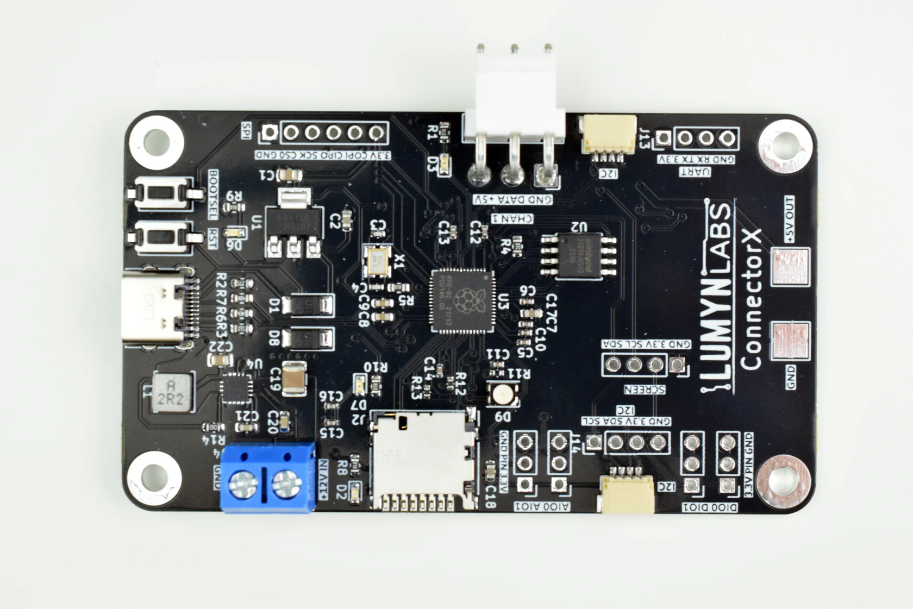

# ConnectorX

ConnectorX brings together years of FRC experience into a single, easy-to-use breakout board. Engineered with the First Robotics Competition (FRC) in-mind, ConnectorX brings together advanced LED control, flexible sensor integration, and robust power management in a single, easy-to-use breakout board. 

## Features

- 2x Grove-compatible I2C connectors
- 2x Digital in/out headers
- 2x Analog in/out headers
- 1x SPI header
- 1 LED channel

## Board Layout

## Power Management