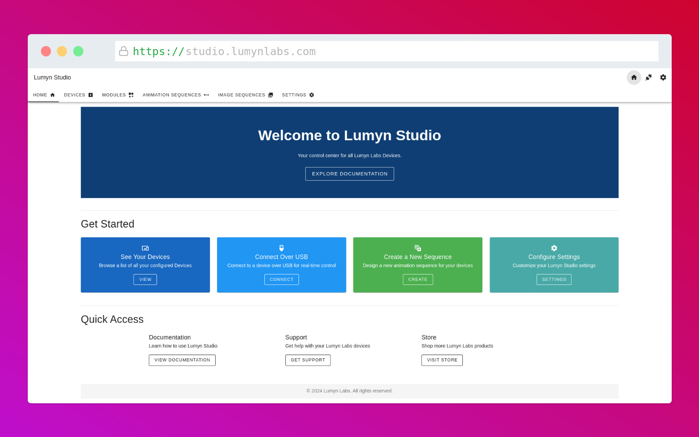

# Lumyn Studio

This section provides documentation for **Lumyn Studio**, the software tool used to configure and control Lumyn Labs devices.

- [Getting Started](/lumyn-studio/getting-started/)
- [Connected Device Panel](/lumyn-studio/connected-device-panel/)
- [Modules Page](/lumyn-studio/modules-page/)
- [Animation Sequences](/lumyn-studio/animation-sequences/)
- [Image Sequences](/lumyn-studio/image-sequences/)
- [Exporting Device Configurations](/lumyn-studio/exporting-device-configurations/)
- [Settings Page](/lumyn-studio/settings-page/)

## Overview

Lumyn Studio is a web-based tool that allows you to easily configure and control Lumyn Labs devices. With an intuitive interface, it provides a variety of features, including:

- Device configuration
- Exporting device configurations
- Animation and image sequence creation
- Module management
- Device Control
- And more!

## Getting Started

To get started with lumyn studio, visit the [Getting Started](/lumyn-studio/getting-started/#) page.