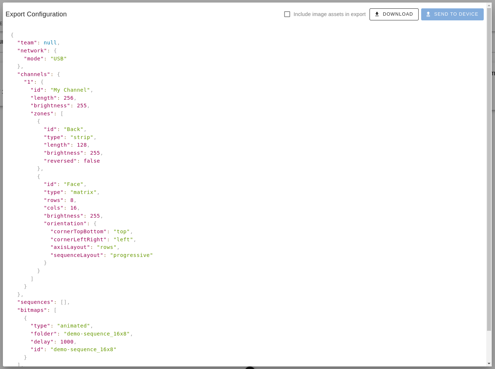

# Exporting Device Configurations

Once you have created a device configuration, you need to export it from **Lumyn Studio** to use it with your physical device. This section provides documentation on how to export device configurations in Lumyn Studio.

## Exporting the Configuration

To export a device configuration as a JSON file, navigate to the Devices page in Lumyn Studio. Click on the device configuration you want to export. This will open up the device configuration page. By default, this page will display a preview of the device configuration. To learn more about this page, visit the [Getting Started](/lumyn-studio/getting-started/#the-devices-tab) documentation.

To export the device configuration, click the **Export Configuration** button in the top right of the page. This will open a dialog that displays the device's configuration as JSON, along with some additional options for exporting.

If you have added any image sequences to the device, you can choose to export them along with the configuration. To do this, check the **Include Image Assets in Export** checkbox. This will download a zip file containing the configuration JSON at the root level and a folder for each image sequence, containing the images in the sequence.

## Sending a JSON Configuration to a Device.

If you chose to download the configuration as JSON, you can still send it to a device by copying it to the device's microSD card. It is important to keep the file structure intact, as the device expects the configuration to be in a specific format.

The configuration file should be placed in the root directory of the microSD card. If you have image sequences, the images should be placed in a folder named after the image sequence, also in the root directory of the microSD card. If you checked the **Include Image Assets in Export** checkbox, the zip file will already be structured correctly.