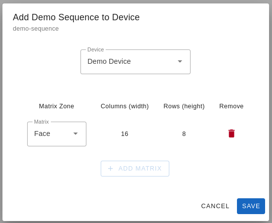

# Image Sequences

This section provides documentation for creating and managing **Image Sequences** in Lumyn Studio. Image sequences are a series of images displayed in order on an LED matrix. You can create them by starting from a single image, importing a GIF, or drawing directly on the canvas.

## Creating a New Image Sequence

To create a new image sequence, navigate to the **Image Sequences** page in Lumyn Studio. By default, this page is empty.If you have existing image sequences, they will be displayed here. Hover over any sequence to preview its animation.

To create a new image sequence, click the "**Create Image Sequence**" button. This will open a dialog where you can configure the image sequence. Start by selecting your image source:

- **Single Image**: Create an image sequence from a single image. This is useful for displaying static images on your LED matrix or when you want to design the sequence frame by frame.
- **Animated GIF**: Import a GIF file to create an image sequence. This is useful when you have an existing GIF animation that you want to display on your LED matrix.
- **Free-Draw**: Draw directly on the canvas to create an image sequence. This is useful for creating custom animations or patterns, displaying text, or drawing shapes on your LED matrix.

Next, assign an **ID** (used for referencing the sequence in code) and a name. Choose an **aspect ratio** for the canvas (ideally matching your LED matrix or image source) and add a **description** and **tags** for organization. Click "**Create**" to finalize your sequence.

## Editing an Image Sequence

To edit an image sequence, click on the sequence in the **Image Sequences** page. This will open the **Image Sequence Editor**, where you can add and remove images in the sequence. The editor is divided into three main sections:

- **Preview**: This area shows a preview of what the image sequence will look like.
- **Controls**: This area provides tools for adding, removing, and editing objects on the canvas as well as a play bar to scrub through the sequence.
- **Frame List**: To the right of the Preview is the frame list. This area shows all the frames in the sequence and allows you to add, remove, and save changes to frames.

### Adding Objects

Use the toolbar to add objects to the canvas. Some tools add objects immediately, while others open customization options:

- **Text**: Add text to the canvas. You can customize the font, size, color, alignment and more.
- **Rectangle**: Add a rectangle to the canvas.
- **Circle**: Add a circle to the canvas.
- **Triangle**: Add a triangle to the canvas.
- **Line**: Add a line to the canvas.

Once added, objects can be moved, resized, and customized using the toolbar. To remove an object, select it and click "Delete." Hover over a tool to see a tooltip description.

### Managing Frames

To add a new frame, click the "**+**" icon above the frame list. Frames can be edited by adding objects to the canvas. To remove a frame, click the "**...**" icon in the frame list and select "**Delete Frame**."

Changes are saved automatically when switching frames, or you can manually save by clicking the **floppy disk icon** above the frame list.

### Finalizing and Exporting

Once editing is complete, click the** hamburger menu** in the top-right corner and select "**Save and Generate**." This compiles the image sequence, which may take some time.

To preview the sequence, hover over "**Preview**" in the menu. Additional options include deleting the sequence or changing the canvas aspect ratio.

## Adding to a Device Configuration

Once you have created an image sequence, you can add it to a device configuration. To do this, navigate to the image sequence in the **Image Sequences** page and click the "**Add to Device**" button. This will open a dialog where you can choose the device configuration to add the image sequence to.

1. Choose a **device** from the dropdown.
2. Select a **matrix zone** to display the sequence (this determines the exported resolution).
3. Click "**Save**" to apply the sequence to the configuration.

## Next Steps

- Create an [Animation Sequence](/lumyn-studio/animation-sequences/)
- Learn how to [Export Device Configurations](/lumyn-studio/exporting-device-configurations/)
