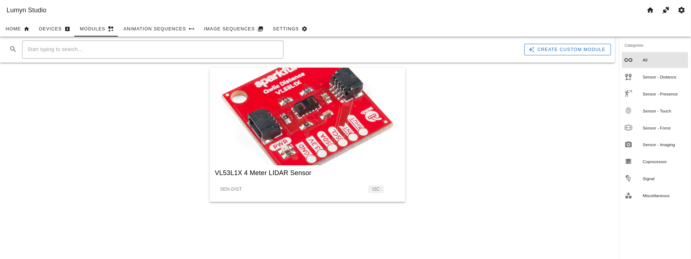
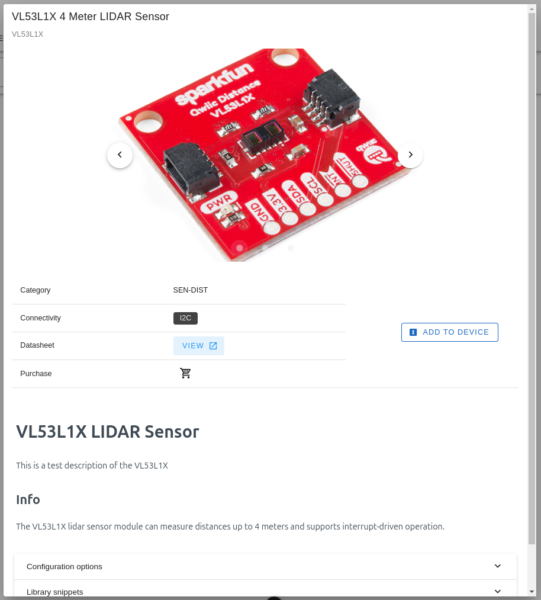
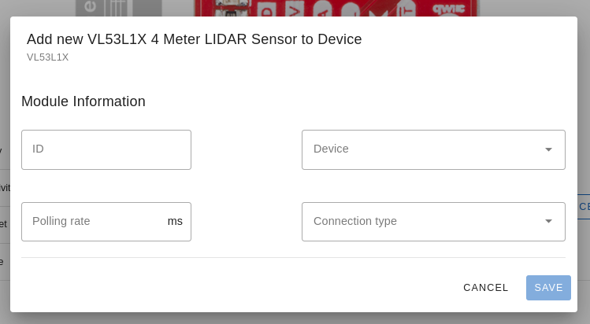
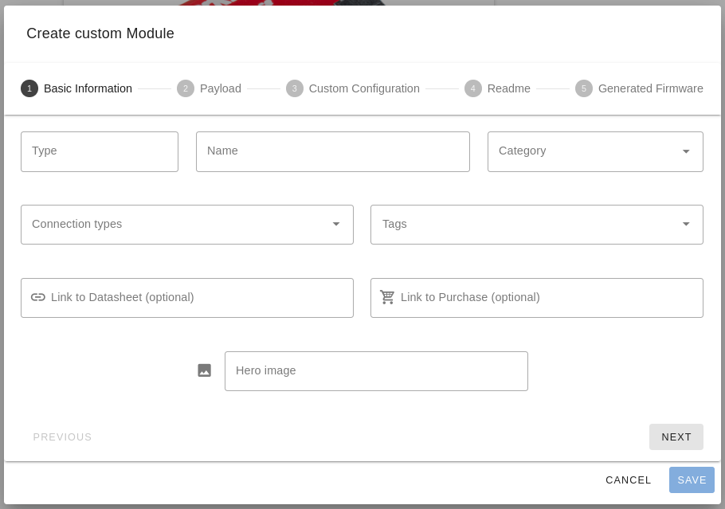
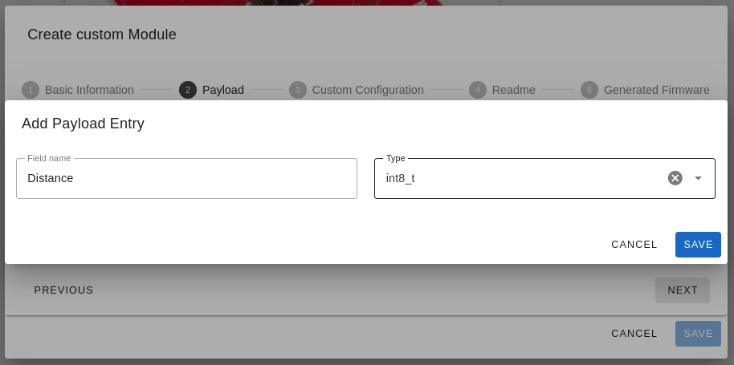
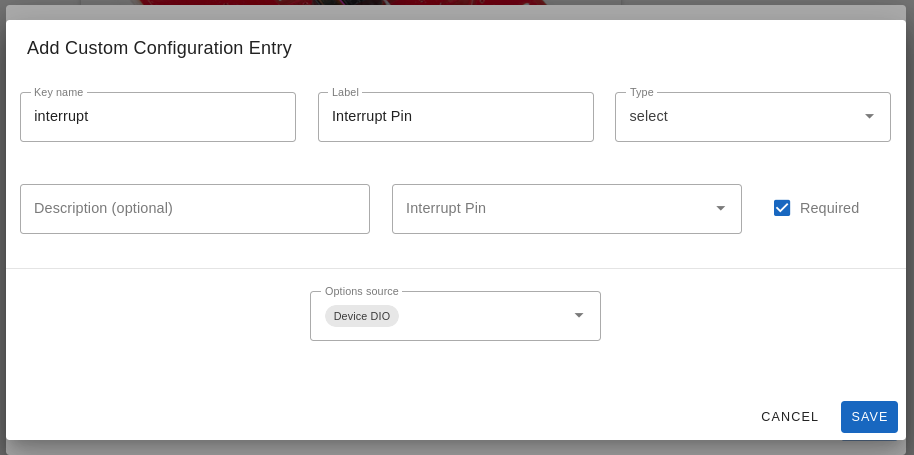
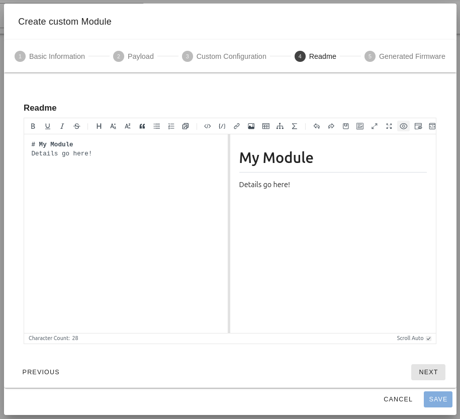
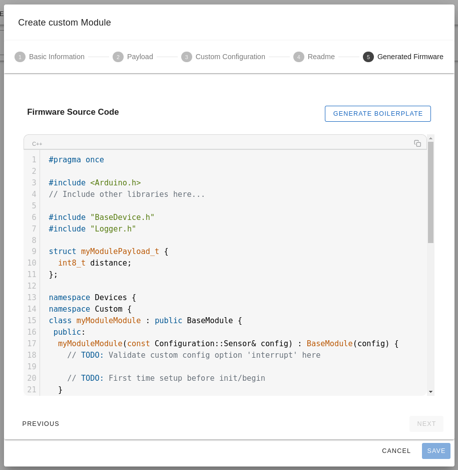

# Modules

This section provides documentation for the **Modules** page in Lumyn Studio. The Modules page allows you to browse official modules, create custom modules, and view more detailed information such as the module's API.

## Overview

The **Modules** page is where you can browse official modules, create custom modules, and view more detailed information such as the module's API. Modules are used to extend the functionality of a device and can be created by anyone. Official modules are created by Lumyn Labs or other contributors and are available for use in the studio.

When you first visit the **Modules** page, you’ll see a list of official modules that are available for use. You can click on a module to view more detailed information. If you're looking for a specific module, you can use the search bar at the top of the page to filter the list or use the category filters to narrow down the results.

## Viewing a Module

To view more detailed information about a module, click on the module in the list. This will open a modal with information about the module, including a description, API, and any additional information that may be available.

The module preview provides images of the module, a description, the options that can be configured when adding the module to a device, snippets of code related to the module, and the source code for the module. You can also navigate directly to the store page for the module or the module's datasheet.

## Adding a Module to a Device

To add a module to a device, click the **Add to Device** button on the module preview. This will open a dialog where you can choose the device configuration to add the module to.

Give the module an ID (this will be used to reference the module in code) and choose a device from the dropdown. The polling rate determines how often the module's data is requested by the device and made available in code. A good default is **100ms**. Choose from the available connection types, and configure any additional options specific to the module under the **Custom Configuration** section. Finally, click **Save** to add the module to the device configuration.

## Creating a Custom Module

> [!TIP]
> Custom modules are a powerful way to extend the functionality of a device. However, creating a custom module requires knowledge of the device's API and how to interact with it.

To create a custom module, click the **Create Custom Module** button at the top of the Modules page. This will open a dialog where you can configure the custom module.

The module creation dialog is divided into five pages:

1. **Basic Information**: Information that is required for all modules, such as the module's name, category, and image.
2. **Payload**: The payload that gets sent every time the module is polled. This is where you can define the data structure that the module will return.
3. **Custom Configuration**: Information that is specific to the module, such as an interrupt pin.
4. **Readme**: A markdown editor where you can provide detailed information about the module, including how to use it and any additional information that may be helpful. This is useful if you plan to share the module with others.
5. **Generated Firmware**: A preview of the generated firmware for the module. Once you have filled out all of the required information, you can click **Generate Firmware** to recieve boilerplate code for the module.

### Basic Information

The **Basic Information** page is where you provide information about the module, such as the module's name, category, and image.

- **Type**: The model number of the module.
- **Name**: The display name of the module. This will be the title of the module's card in the studio.
- **Category**: The category that the module belongs to. This is used to filter modules in the studio.
- **Connection Types**: The connection types that the module supports. This determines how the module communicates with the device.
- **Tags**: Optional tags that can be used to filter modules when searching.
- **Link to Datasheet**: A link to the module's datasheet. This is useful when creating custom modules that are based on existing hardware.
- **Link to Purchase**: A link to where the module can be purchased. This is useful when creating custom modules that are available for purchase.
- **Hero Image**: An image of the module. This will be displayed on the module's card in the studio.

### Payload

The **Payload** page is where you define the data structure that the module will return when polled. This is the data that will be available in code when interacting with the module. To add a new field, click **Add Entry**, provide a name, and choose a type. The maximum length of the payload is 16 bytes.

### Custom Configuration

The **Custom Configuration** page is where you provide information that is specific to the module, such as an interrupt pin. This information will be available in code when interacting with the module.

### Readme

The **Readme** page is where you provide detailed information about the module, including how to use it and any additional information that may be helpful. This is useful if you plan to share the module with others.

### Generated Firmware

The **Generated Firmware** page is a preview of the generated firmware for the module. Once you have filled out all of the required information, you can click **Generate Firmware** to recieve boilerplate code for the module.

Once you have generated the firmware, you can download the code and use it to create the module. Finally, click **Save** to add the custom module to the studio.