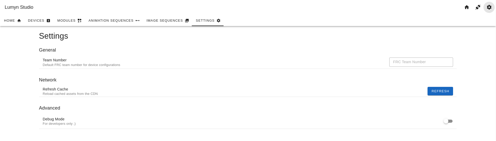

# Settings Page

The **Settings Page** allows you to configure settings that do not belong to a specific device. This page is accessible from the title bar at the top of the screen or by clicking the gear icon in the title bar.

## FRC Team Number

The **FRC Team Number** setting allows you to set the team number for your FRC team. It must be a valid FRC team number (a whole number between 1 and 99999). This setting is used in the device configuration but is optional.

## Cache

Lumyn Studio caches items from the CDN to improve load times, such as module images and other assets. This setting allows you to clear the cache if you're experiencing issues with the studio.